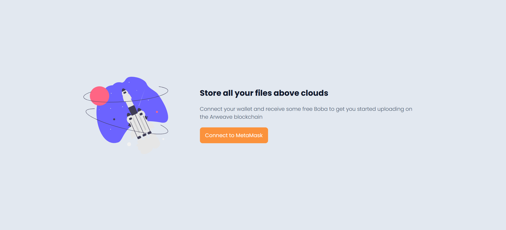
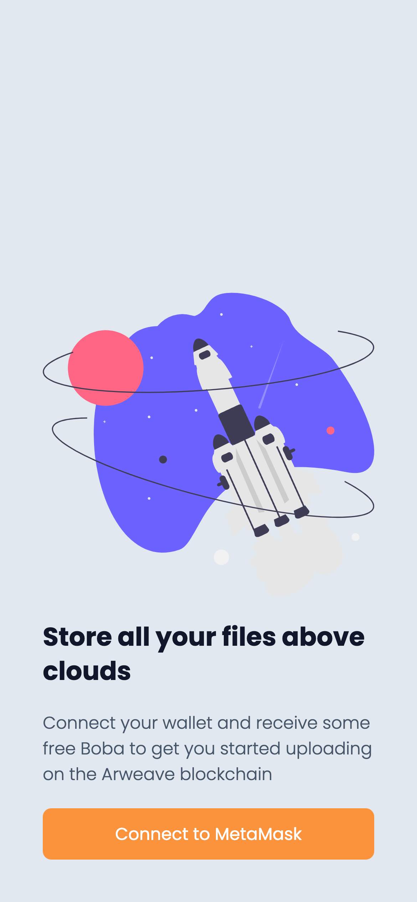
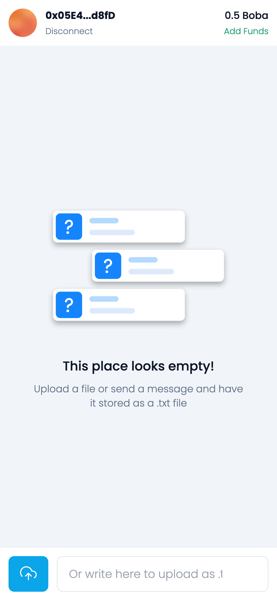
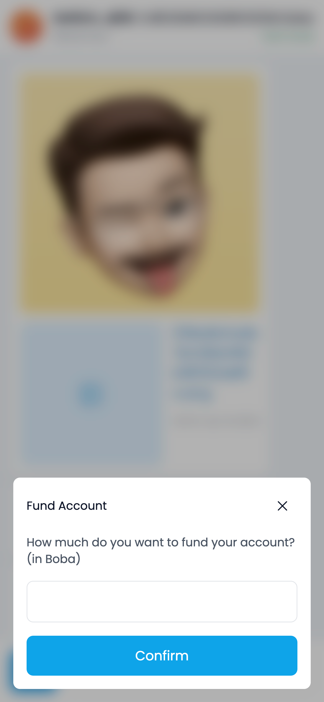
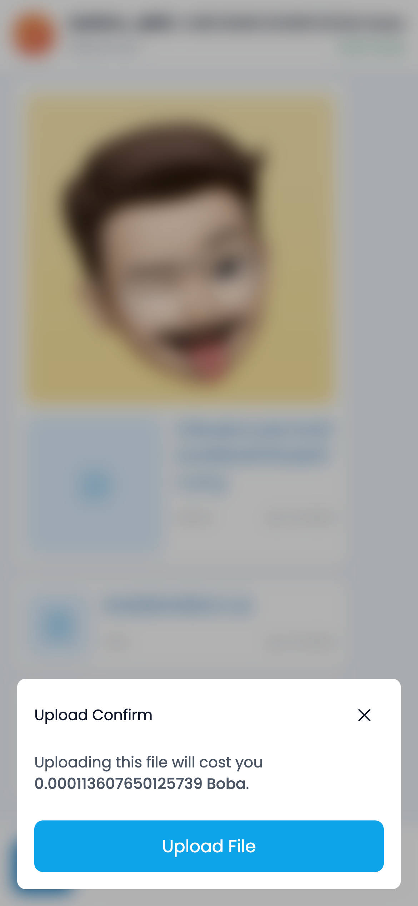
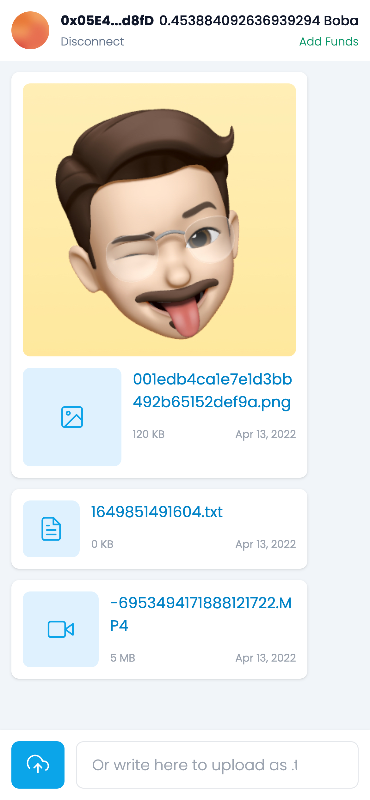

# BobaFileManager
#### A web app that allows users to store their files on the Arweave blockchain using Boba tokens as payment through an intuitive and familiar interface.
View online demo at [http://185.231.59.231:8080/](http://185.231.59.231:8080/)

You can watch a screen record of how the app behaves on [YouTube](https://youtu.be/KiRGawT8k-w) .

> This project was developed for [Boba, Bundlr & Arweave Hackathon](https://gitcoin.co/issue/bundlr-network/bounties/2/100028670) bounty

    

### Mobile screenshots

  
  
  
  
  

